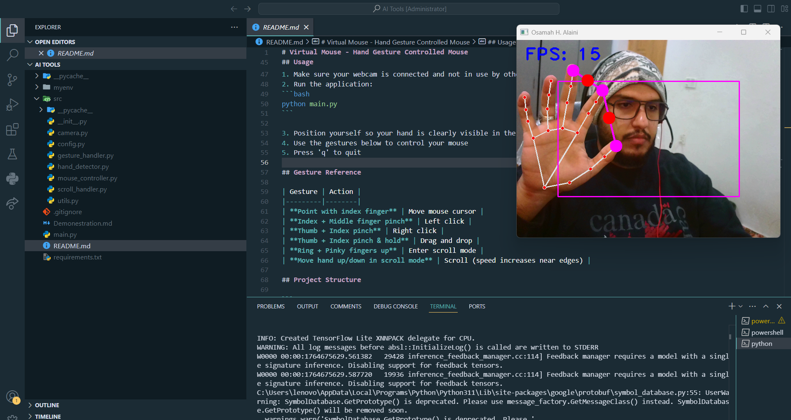
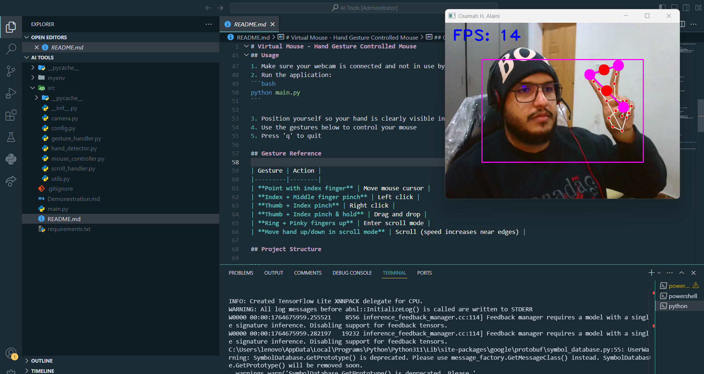
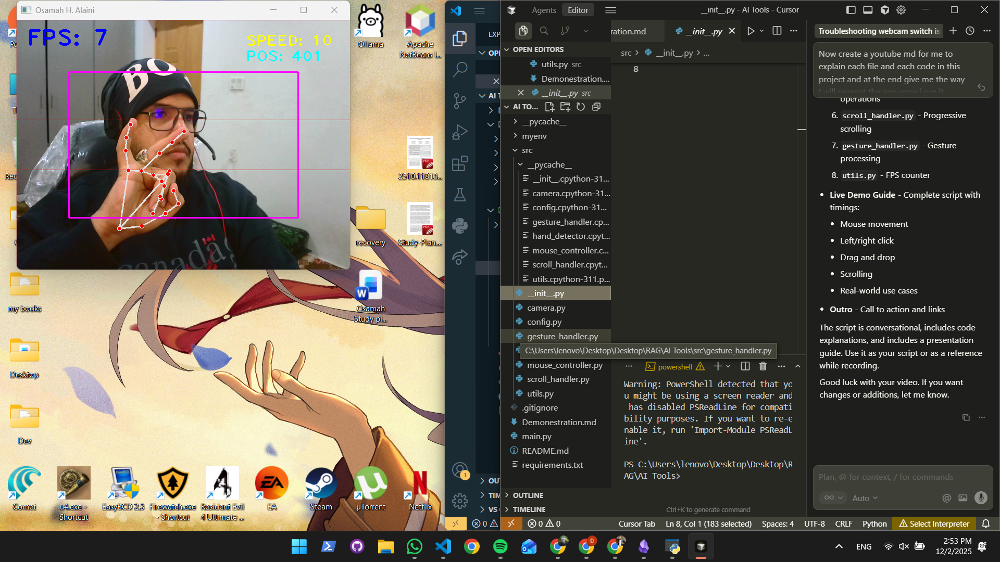

# Virtual Mouse - Hand Gesture Control

A hand tracking application for controlling computer mouse through webcam-based gesture recognition. This project was developed as part of my third-semester coursework to explore computer vision, real-time image processing, and human-computer interaction.

## Overview

This application uses MediaPipe hand tracking to detect and interpret hand gestures in real-time, mapping them to mouse operations. The implementation follows clean architecture principles with modular design, making it easy to understand, modify, and extend.

The project demonstrates practical applications of computer vision in HCI, combining hand landmark detection, gesture recognition algorithms, and system-level mouse control.

## Features

### Mouse Movement

Point with your index finger to move the cursor. The application maps hand coordinates to screen coordinates with configurable smoothing to reduce jitter.



### Left Click

Pinch your index and middle fingers together to perform a left click. The system detects finger proximity using Euclidean distance calculation between landmark points.

### Right Click

Pinch your thumb and index finger together while keeping your middle finger down to trigger a right click. This gesture uses a different finger combination to avoid conflicts with left click detection.




### Drag and Drop

Pinch your thumb and index finger together and hold for 0.3 seconds to activate drag mode. The mouse button remains pressed until you release the pinch or change gestures.

### Smart Scrolling

Show your ring and pinky fingers while keeping other fingers down to enter scroll mode. Hand position relative to the camera frame determines scroll speed with progressive acceleration.

The scrolling system uses a three-zone approach:
- Neutral zone (center): No scrolling
- Acceleration zones (top/bottom): Progressive speed increase based on distance from center
- Quadratic speed curve for smooth transitions




### Visual Feedback

Real-time FPS counter, gesture mode indicators, scroll speed display, and visual zone overlays help users understand system state and gesture recognition.

## Technologies and Libraries

- **MediaPipe**: Google's hand landmark detection framework providing 21 points per hand with sub-millisecond latency
- **OpenCV**: Computer vision library for image processing, camera capture, and drawing operations
- **NumPy**: Numerical operations for coordinate transformations and interpolation
- **autopy**: Cross-platform mouse control library for movement and click operations
- **PyAutoGUI**: Mouse wheel scrolling support with better cross-platform compatibility
- **Python 3.8+**: Core language with standard library for time management and system operations

## Architecture

The project follows a modular architecture with clear separation of concerns:

- **Configuration Layer**: Centralized constants in `config.py` for easy customization
- **Hardware Abstraction**: Camera initialization with multiple backend support and fallback mechanisms
- **Detection Layer**: Hand tracking using MediaPipe with landmark extraction and finger state analysis
- **Control Layer**: Mouse operations abstraction for movement, clicks, and scrolling
- **Logic Layer**: Gesture recognition and state management for different interaction modes
- **Application Layer**: Main loop coordinating all components with error handling

This structure allows each component to be developed, tested, and modified independently while maintaining clean interfaces between modules.

## Installation

### Prerequisites

- Python 3.8 or higher
- Webcam device
- Windows, macOS, or Linux operating system

### Setup

Clone the repository:
```bash
git clone <repository-url>
cd virtual-mouse
```

Create and activate a virtual environment:
```bash
python -m venv venv

# Windows
venv\Scripts\activate

# macOS/Linux
source venv/bin/activate
```

Install dependencies:
```bash
pip install -r requirements.txt
```

## Usage

1. Ensure your webcam is connected and not in use by other applications
2. Run the application:
```bash
python main.py
```

3. Position your hand so it's fully visible within the camera frame
4. Use the gesture reference below to control the mouse
5. Press 'q' to quit the application

### Gesture Reference

| Gesture | Action |
|---------|--------|
| Index finger extended | Move mouse cursor |
| Index + Middle finger pinch | Left click |
| Thumb + Index pinch (middle down) | Right click |
| Thumb + Index pinch (hold 0.3s) | Drag and drop |
| Ring + Pinky up (others down) | Enter scroll mode |
| Move hand up/down in scroll mode | Scroll with progressive speed |

## Project Structure

```
.
├── main.py                    # Application entry point and main event loop
├── requirements.txt           # Python package dependencies
├── README.md                  # Project documentation
├── .gitignore                 # Git ignore rules
├── screenshots/               # Demonstration images
└── src/                       # Source code modules
    ├── __init__.py            # Package initialization
    ├── config.py              # Configuration constants
    ├── camera.py              # Camera initialization and backend handling
    ├── hand_detector.py       # MediaPipe hand tracking wrapper
    ├── mouse_controller.py    # Mouse operation abstraction
    ├── gesture_handler.py     # Gesture recognition and state management
    ├── scroll_handler.py      # Scroll mode logic and progressive speed calculation
    └── utils.py               # Utility functions (FPS counter, visual helpers)
```

## Configuration

Application behavior can be customized by modifying constants in `src/config.py`:

- `CAMERA_WIDTH`, `CAMERA_HEIGHT`: Video capture resolution (default: 640x480)
- `CAMERA_PRIORITIES`: Camera index preference list for initialization
- `FRAME_REDUCTION`: Boundary margin for active interaction area
- `SMOOTHENING`: Mouse movement smoothing factor (higher = smoother, slower response)
- `BASE_SCROLL_SENSITIVITY`: Minimum scroll speed
- `MAX_SCROLL_SENSITIVITY`: Maximum scroll speed at frame edges
- `SCROLL_DELAY`: Minimum time between scroll events in seconds
- `DRAG_CLICK_THRESHOLD`: Pinch hold duration required to activate drag (seconds)
- `PINCH_DISTANCE_THRESHOLD`: Maximum distance between landmarks for pinch detection (pixels)

## Technical Implementation Details

### Hand Landmark Detection

MediaPipe provides 21 landmarks per hand. The system uses specific landmark indices:
- Landmark 0: Wrist (reference point)
- Landmark 4, 8, 12, 16, 20: Finger tips (thumb, index, middle, ring, pinky)
- Landmark 3, 6, 10, 14, 18: PIP joints for finger state detection

Finger state is determined by comparing tip Y-coordinates with PIP joint Y-coordinates. For thumbs, X-coordinate comparison accounts for hand orientation.

### Coordinate Transformation

Hand landmarks are provided in normalized coordinates (0-1 range). The system converts these to pixel coordinates, then maps camera frame coordinates to screen coordinates using linear interpolation with boundary constraints.

Mouse movement includes X-axis mirroring to account for camera view direction, making hand movement intuitive relative to screen position.

### Gesture State Machine

The application uses a state machine approach for gesture recognition:
- Default state: Waiting for gesture
- Movement state: Index finger extended
- Click states: Temporary transitions on pinch detection
- Drag state: Sustained pinch with time threshold
- Scroll state: Ring + pinky up triggers mode switch

State transitions are handled with priority ordering (scroll mode takes precedence over movement).

### Scroll Speed Algorithm

Scroll speed calculation uses a three-zone system:
1. Calculate neutral zone boundaries (center 20% of frame height)
2. Determine hand position relative to zones
3. Apply quadratic curve (distance squared) for progressive acceleration
4. Map to scroll amount with configurable multiplier

The algorithm smooths scroll values using a moving average of the last 3 calculations to reduce jitter.

### Error Handling

Camera initialization includes multiple fallback mechanisms:
1. Try DirectShow backend on Windows (better compatibility)
2. Fall back to default backend if DirectShow fails
3. Test multiple camera indices with frame read verification
4. Graceful exit with helpful error messages if no camera found

## Performance Considerations

The application processes frames at approximately 20-30 FPS depending on hardware. Performance can be optimized by:
- Reducing camera resolution in configuration
- Adjusting MediaPipe detection confidence thresholds
- Limiting hand drawing operations in debug mode
- Closing unnecessary background applications

## Limitations and Future Improvements

Current limitations:
- Single hand tracking only
- Requires clear lighting and background
- Gesture recognition depends on hand visibility
- Camera-dependent performance varies by hardware

Potential improvements:
- Multi-hand support for complex gestures
- Machine learning-based gesture classification
- Configurable gesture mappings
- Keyboard shortcut support
- Performance optimizations for lower-end hardware

## Use Cases

This project can be useful for:
- Educational purposes in computer vision and HCI courses
- Accessibility applications for hands-free mouse control
- Presentation control systems
- Learning MediaPipe and OpenCV integration
- Demonstrating real-time image processing techniques
- Prototyping gesture-based interfaces

## Contributing

Contributions are welcome. Areas where help would be valuable:
- Additional gesture support
- Performance optimizations
- Cross-platform compatibility improvements
- Documentation enhancements
- Test coverage
- Configuration UI

To contribute:
1. Fork the repository
2. Create a feature branch
3. Make your changes
4. Submit a pull request with clear description

## License

This project is open source and available under the MIT License.

## Acknowledgments

- MediaPipe team for the hand tracking solution
- OpenCV contributors for computer vision tools
- autopy and PyAutoGUI maintainers for mouse control libraries

## Author

Developed as a third-semester academic project to explore computer vision and human-computer interaction concepts.

---

Note: This application requires camera access and appropriate system permissions. Ensure your privacy settings allow camera access for the application.
